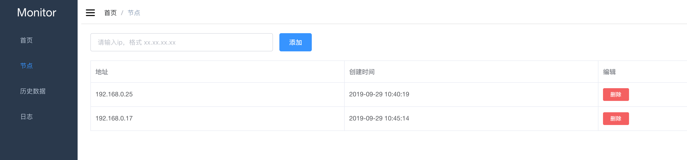
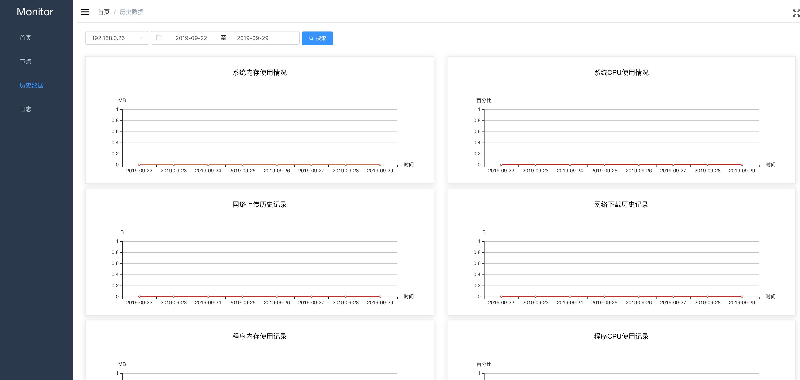
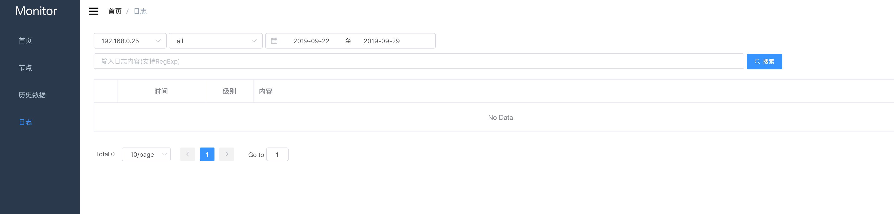

# node-monitor-server
node monitor server

需要配合 node-monitor-client 一起使用才行, 利用client上传的数据，server 进行存储分析。


# 依赖性

依赖 mongodb 数据库

# 配置信息

config/index.js

数据库配置
```js
module.exports= {
  // 数据库配置
  db:{
    production:'',
    development:''
  },
  // 登录信息配置
  dbLogin:{
     production:'',
     development:''
  }
}

```
# 主要功能

## dashboard
显示client 客户端实时信息（websocket 实时上传的数据）。

## 节点配置

主要配置client 客户端信息,需要监听的客户端的IP 信息。

## 历史记录

主要记录dashboard的历史记录

## 日志
主要记录程序的 log 日志

# DOC

## 监控指标

- 访问特定域名的PV和UV量
- 机器的硬件情况(CPU，内存，磁盘等)
- 特定域名下，各个URL的请求次数，响应时间信息


## 核心功能

- 收集信息，有专门用于采集信息的程序用来采集信息
- 存储信息，把采集到的信息存储到mongo数据库中
- 展示信息，使用echarts将信息图表化
- 清理信息，无需进行长期存储的信息定时清除


## 信息获取
Nginx信息获取使用了开源项目OpenResty


## 借鉴

https://cnodejs.org/topic/595b9ce1545d7a7b5b0b3984


# 部分截图

</img>

</img>

</img>

</img>

# 部署(pm2)
> npm run pre-build && npm run build


