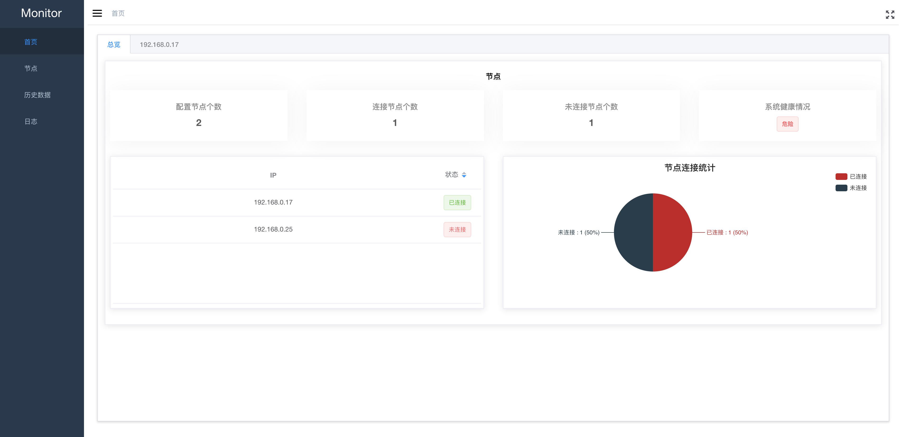

# node-monitor-server
node monitor server

需要配合 node-monitor-client 一起使用才行, 利用client上传的数据，server 进行存储分析。


# 依赖性

依赖 mongodb 数据库

# 配置信息

config/index.js

数据库配置
```js
module.exports= {
  // 数据库配置
  db:{
    production:'',
    development:''
  },
  // 登录信息配置
  dbLogin:{
     production:'',
     development:''
  }
}

```
# 主要功能

## dashboard
显示client 客户端实时信息（websocket 实时上传的数据）。

## 节点配置

主要配置client 客户端信息,需要监听的客户端的IP 信息。

## 历史记录

主要记录dashboard的历史记录

## 日志
主要记录程序的 log 日志


# 部分截图

</img>

</img>

</img>

</img>

# 部署(pm2)
> npm run pre-build && npm run build


